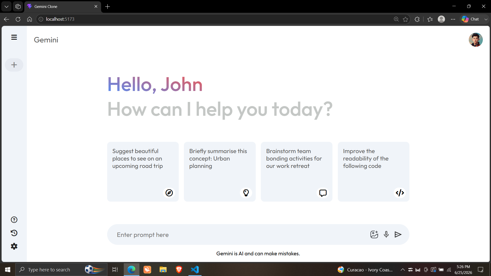
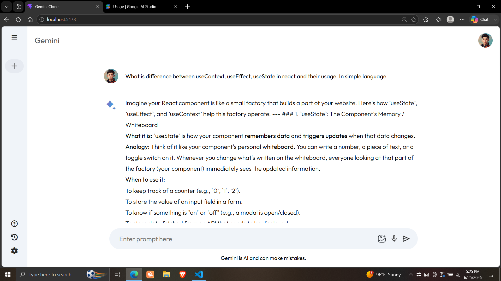
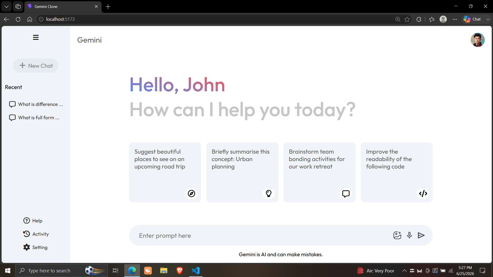

# Gemini React Clone

A responsive AI chatbot inspired by Google Gemini, built with **React**, **Vite**, and the **Google Gemini API**. The application features a modern chat interface, recent chat history, typing animation, Markdown-style formatting, and robust error handling.

## Preview

### Home Page



### Chat Interface



### Recent Chats Sidebar



## Features

* AI-powered conversations using the Google Gemini API
* Responsive and modern user interface
* Animated typing effect for AI responses
* Recent chat history
* Start a new chat
* Markdown-style text formatting (bold text support)
* Loading indicator while generating responses
* Graceful error handling for:

  * Invalid API key
  * Server unavailable
  * Network errors
* State management using React Context API

## Tech Stack

* React
* Vite
* JavaScript (ES6+)
* React Context API
* CSS3
* Google Gemini API

## Installation

Clone the repository:

```bash
git clone https://github.com/MSK1305/Gemini-React-Clone.git
cd Gemini-React-Clone
```

Install dependencies:

```bash
npm install
```

Create a `.env` file in the project root:

```env
VITE_GEMINI_API_KEY=YOUR_GEMINI_API_KEY
```

Start the development server:

```bash
npm run dev
```

## Project Structure

```text
gemini-clone/
├── public/
│   ├── Home.png
│   ├── Main.png
│   └── Sidebar.png
├── src/
├── package.json
├── vite.config.js
└── .env
```

## Future Improvements

* Chat history persistence
* Multiple chat sessions
* Dark mode
* Voice input
* Image generation support
* Syntax highlighting for code responses

## Note

This project uses the Google Gemini API. To run it locally, create a `.env` file and add your own Gemini API key.

```env
VITE_GEMINI_API_KEY=YOUR_GEMINI_API_KEY
```

> **Do not commit your `.env` file or API key to GitHub.**

## License

This project is created for learning and portfolio purposes.
